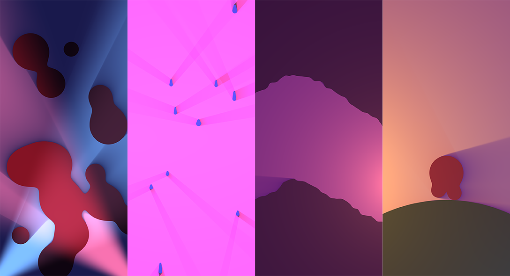

#  SDF-2D library

A graphics library to enable the real-time rendering of 2D signed distance fields on the web.


## Links

- [View it in action (demos)](https://sdf2d.schmelczer.dev)
- [View it in action (video game)](https://decla.red)
- [Documentation](https://schmelczerandras.github.io/sdf-2d/)
- [In-depth information](https://github.com/schmelczerandras/sdf-2d/blob/master/media/sdf-2d.pdf)

## Features

- Works with both WebGL and WebGL2
  > The former is mostly required for supporting iPhones.
- Performant even on low-end mobile devices
  > Try it out yourself!
- Has a number of built-in shapes and lights
- Easily extensible with new shapes
- Antialiasing is implemented
- Has built-in quality autoscaling
- Requires no boilerplate code
  - Automatic detection of WebGL and its extensions is provided
  - Parallel, non-blocking shader compiling
  - Context lost is handled with automatic restoration
  - Can be used without thinking of the GPU _(although for stunning results it, should be kept in mind)_



> Four separate screenshots taken on a mobile device

## Install

```sh
npm install sdf-2d --save-dev
```

## Use

```js
import { compile, CircleFactory, hsl, CircleLight } from 'sdf-2d';

const main = async () => {
  const Circle = CircleFactory(hsl(30, 66, 50));
  const canvas = document.querySelector('canvas');

  const renderer = await compile(canvas, [Circle.descriptor, CircleLight.descriptor]);

  renderer.addDrawable(new Circle([200, 200], 50));
  renderer.addDrawable(new CircleLight([500, 300], [1, 0.5, 0], 0.5));
  renderer.renderDrawables();
};

main();
```

> A commented version of the above code can be found [in this repo](https://github.com/schmelczerandras/sdf-2d-minimal-example).

## Examples

For further examples, please visit the following repositories:

- [Minimal example (using Webpack)](https://github.com/schmelczerandras/sdf-2d-minimal-example)
- [More complex example](https://github.com/schmelczerandras/sdf-2d-minimal-example)
- [Source for the demo page](https://github.com/schmelczerandras/sdf-2d-demo)
- [Source for decla.red, the multiplayer game](https://github.com/schmelczerandras/decla.red)

## Documentation

For more technical details, please consult the documentation available in the repository and at [schmelczerandras.github.io/sdf-2d/](https://schmelczerandras.github.io/sdf-2d/).

## Plans

- Automatic tile multiplier scaling
- Non-uniform tile sizes based on scene density
